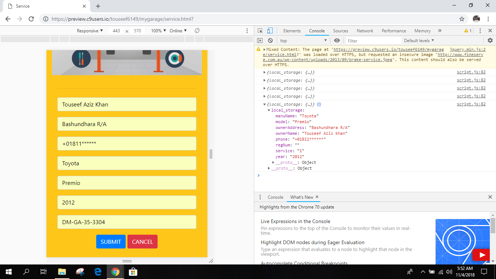

# This is the website of my workshop named "Speedfire Motorsport Ltd".
### This is my home tab.

There are 4 different tabs followed by the logo and some little description about my workshop.
Now, this is my service tab.

If you scroll down the page you will get some service option that is being provided (just for the time being I have showed only 3).

Once you click 'Select For Appointment' button.

A form will appear that the user will have to fill up for the appointment.

Once the user gives an input into the text area, the info has been saved in the local storage as shown in the above screenshot.

And once the submit button has been clicked, it gets back to the service page again.
 
So this is the gallery tab where I have tried to showcase some of our project throughout this one year journey.

In this image gallery I have also tried to give little description at the bottom of the images regarding the project.

And at the last tab I have tried to give the address of our workshop as a screenshot of google maps. 
So in short I have used HTML, CSS, JAVASCRIPT, jQuery, localStorage, Bootstrap, Responsive UI and it also has the multiple views and multiple states that changes upon user interaction. 